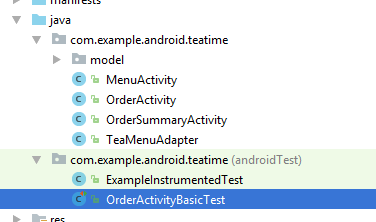
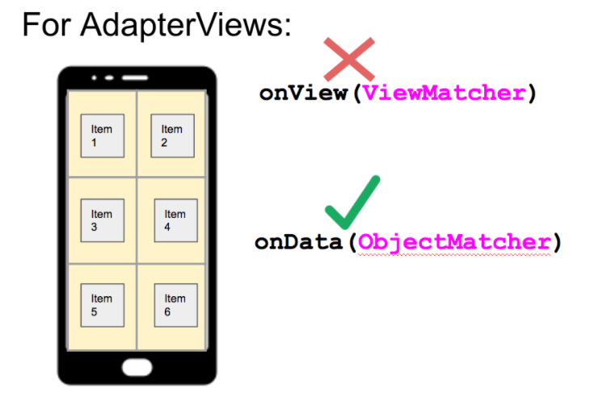
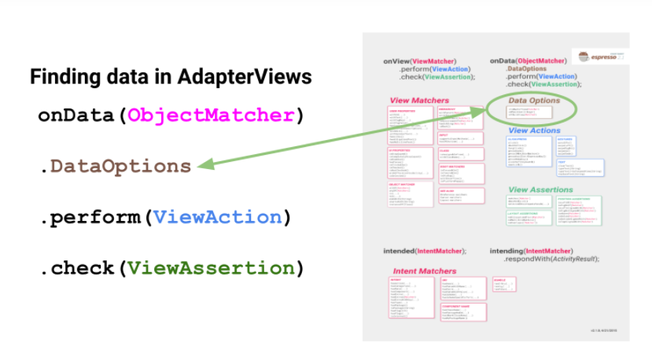
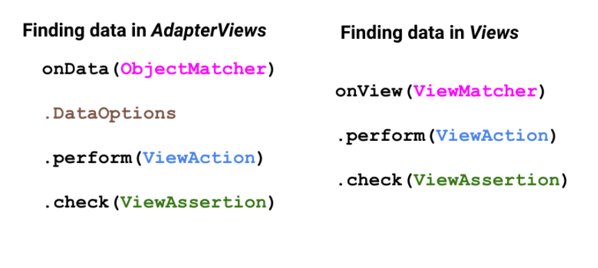
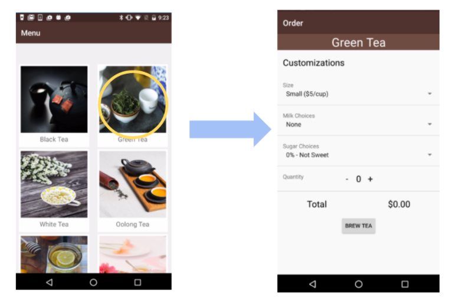

# TeaTime Code

This is a exercise repository for the TeaTime example app which is part of Udacity's Advanced Android course. TeaTime is a mock tea ordering app that demonstrates various uses of the Espresso Testing framework (i.e. Views, AdapterViews, Intents, IdlingResources). You can learn more about how to use this repository [here](https://classroom.udacity.com/courses/ud857/lessons/8b2a9d63-0ff5-48ff-90d3-a9855b701dae/concepts/41b82e3c-2797-46e5-8a66-684098ca8cbb).

## Adding the Gradle application dependencies

```gradle
    dependencies {
        compile 'com.android.support:design:26.1.0'
        compile 'com.android.support:support-annotations:27.0.1'
        compile 'com.google.android.gms:play-services-appindexing:9.8.0'
        androidTestCompile 'junit:junit:4.12'


        //Testing-only dependencies
        androidTestCompile 'com.android.support:support-annotations:27.0.1'
        androidTestCompile 'com.android.support.test.espresso:espresso-core:3.0.1'

    }
```

**Note:** ```compile 'com.android.support:support-annotations:27.0.1'``` and ```androidTestCompile 'com.android.support:support-annotations:27.0.1'``` must have the same versions.


## What can be tested with Espresso

* Views
* AdaptersViews
* Intents
* Idling Resources

## Creating a simple user Interface (UI) test - (Views)

1. Create a new class file within the *androidTest* folder (Instrumented test)



Name the file correctly using the following convention ```OrderActivityBasicTest```, that means that this class will be used for performing basic teston the ```OrderActivity```class.
The *Test* at the end of the name shows others developers that the class is just for testing proposals.

2. Start off this file with the ```@RunWith(AndroidJUnit4.class)```

```java
    import android.support.test.runner.AndroidJUnit4;

    import org.junit.runner.RunWith;

    @RunWith(AndroidJUnit4.class)
    public class OrderActivityBasicTest {

    }
```

**NOTE:** This line makes the *AndroidStudio* know that this class have to be executed with the ***AndroidJUnit4***

3. Add the ```ActivityTestRule``` in the body of the test

```java
    @RunWith(AndroidJUnit4.class)
    public class OrderActivityBasicTest {

        @Rule public ActivityTestRule<OrderActivity> mActivityTestRule = new ActivityTestRule<>(OrderActivity.class);

    }
```

**NOTE** The ```ActivityTestRule``` provides functional test for a specific single Activity. In this case for the ```OrderActivity.class```

4. Add the tests

```java
    @RunWith(AndroidJUnit4.class)
    public class OrderActivityBasicTest {

        @Rule public ActivityTestRule<OrderActivity> mActivityTestRule
                = new ActivityTestRule<>(OrderActivity.class);


         @Test
            public void clickIncrementButton_ChangesQuantityAndCost(){
                //1. Fin the View and 2. Perform action on the view
                onView((withId(R.id.increment_button))).perform(click());

                //3. Check if the view does what you expected
                onView(withId(R.id.quantity_text_view)).check(matches(withText("1")));
                onView(withId(R.id.cost_text_view)).check(matches(withText("$5.00")));
            }

        @Test
         public void test2(){
             //1. Fin the View
             //2. Perform action on the view
             //3. Check if the view does what you expected

         }

    }

```

5. Run the test

## Test AdapterViews with Espresso

Espresso does require a  method call when dealing with AdapterView widgets. Since *AdapterViews* such as *ListView* and *GridView* load data dynamically from an Adapter, only a subset of the contents may be loaded in the current view hierarchy at a time. This means that ```onView()``` may not be able to find the necessary view.

To handle this we need to use ```onData()``` which loads the adapter item we are interested in onto the screen before operating on it.



To help us further specify the item in the AdapterView we’re interested in, we can use a DataOption method such as ```inAdapterView()``` or ```atPosition()```. These methods are highlighted in the cheat sheet below.



**Notice** that how we test Views in AdapterViews is very similar to how we test single Views - *matching, acting, and asserting*.



One test I’d like to run is clicking on a gridView tea item and checking that it opens up the corresponding tea OrderActivity.




### Steps

1. Create a new class file within the *androidTest* folder (Instrumented test)
2. Start off this file with the ```@RunWith(AndroidJUnit4.class)```
3. Add the ```ActivityTestRule``` in the body of the test

    **NOTE** The ```ActivityTestRule``` provides functional test for a specific single Activity. In this case for the ```OrderActivity.class```

4. Add the tests *@Test*


```java
   @RunWith(AndroidJUnit4.class)
   public class MenuActivityScreenTest {

       public static final String TEA_NAME = "Green Tea";


       /**
        * The ActivityTestRule is a rule provided by Android used for functional testing of a single
        * activity. The activity that will be tested will be launched before each test that's annotated
        * with @Test and before methods annotated with @Before. The activity will be terminated after
        * the test and methods annotated with @After are complete. This rule allows you to directly
        * access the activity during the test.
        */

       @Rule
       public ActivityTestRule<MenuActivity> mMenuActivityTestRule
               = new ActivityTestRule<>(MenuActivity.class);

       @Test
       public void clickGridViewItem_OpensOrderActivity() {

           // gridview item and clicks it.
           onData(anything()).inAdapterView(withId(R.id.tea_grid_view)).atPosition(1).perform(click());

           // Checks that the OrderActivity opens with the correct tea name displayed
           onView(withId(R.id.tea_name_text_view)).check(matches(withText(TEA_NAME)));

       }

   }
```


5. Run the test


## Test intents Stubbing and Verification


## General steps of Espresso View Testing

1. Find the view
2. Perform action on the view
3. Check if the view does what you expected

## References
[Testing Apps on Android - Espresso](https://developer.android.com/training/testing/espresso/index.html)

[Android Espresso cheat sheet](https://developer.android.com/training/testing/espresso/cheat-sheet.html)

[DataIteration](https://developer.android.com/reference/android/support/test/espresso/DataInteraction.html)

